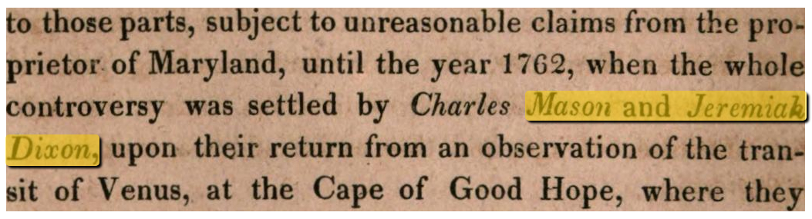

# solr-ocrhighlighting



**[Documentation](https://dbmdz.github.io/solr-ocrhighlighting)**<br>
**[Demo](https://ocrhl.jbaiter.de)**

This Solr plugin lets you put word-level OCR text into one or more of you documents'
fields and then allows you to obtain structured highlighting data with the text
and its position on the page at query time. All this without having to store
the OCR data in the index itself, instead reusing the existing OCR files on disk.

It works by extending Solr's standard `UnifiedHighlighter` with support for
loading external field values and determining OCR positions from those field
values. This means that all options and query types supported by the
`UnifiedHighlighter` are also supported for OCR highlighting. The plugin also
works transparently with non-OCR fields and just lets the default
implementation handle those.

The plugin **works with all Solr versions >= 7.x** (tested with 7.6, 7.7 and 8.0).

## Features
- Index hOCR, ALTO or [MiniOCR](https://dbmdz.github.io/solr-ocrhighlighting/formats/) directly without preprocessing
- Retrieve all the information needed to render a highlighted snippet view directly from Solr, without postprocessing
- Keeps your index size manageable by not storing the OCR in the index

## Installation

1. Download the latest JAR from the [GitHub Releases Page](https://github.com/dbmdz/solr-ocrhighlighting/releases)
2. Drop the JAR into the `core/lib/` directory for your Solr core
3. Refer to the [Documentation](https://dbmdz.github.io/solr-ocrhighlighting)
   for instructions on how to configure Solr and index documents

## Compiling
If you want to use the latest bleeding-edge version, you can also compile the plugin yourself.
For this you will need at least Java 8 and Maven:

```sh
$ mvn package
```

The JAR will be in `target/solr-ocrhighlighting-$version.jar`.

## Running the example


The repository includes a full-fledged example setup based on the [Google
Books 1000](http://yaroslavvb.blogspot.com/2011/11/google1000-dataset_09.html)
and the [BNL L'Union Newspaper](https://data.bnl.lu/data/historical-newspapers/) datasets.
The Google Books dataset consists of 1000 Volumes along with their OCRed text
in the hOCR format and all book pages as full resolution JPEG images.
The BNL dataset consists of 2712 newspaper issues in the ALTO format and all
pages as high resolution TIF images.

The example ships with a search interface that allows querying the OCRed texts and displays
the matching passages as highlighted image and text snippets. Also included
is a small IIIF-Viewer that allows viewing the documents and searching for
text within them.

To run:

```
1. `cd example`
2. `docker-compose up -d`
3. `./ingest.py`
4. Access `http://localhost:8181` in your browser
```

For more information about the example setup, refer to the [documentation](https://dbmdz.github.io/solr-ocrhighlighting/example/).


## Limitations

- The supported file size is limited to 2GiB, since Lucene uses 32 bit integers throughout for storing offsets


## Contributing

Found a bug? Want a new feature? Make a fork, create a pull request.

For larger changes/features, it's usually wise to open an issue before starting
the work, so we can discuss if it's a fit.

## Support us!

We always appreciate if users let us know how they're using our software and
libraries. It helps us to focus our efforts on our open source offerings, so we
can create even more useful stuff for the community.

So don't hesitate to drop us a line at
[johannes.baiter@bsb-muenchen.de](mailto:johannes.baiter@bsb-muenchen.de) if you could make use of
the plugin :-)

## License

[MIT License](https://github.com/dbmdz/solr-ocrhighlighting/blob/master/LICENSE)
