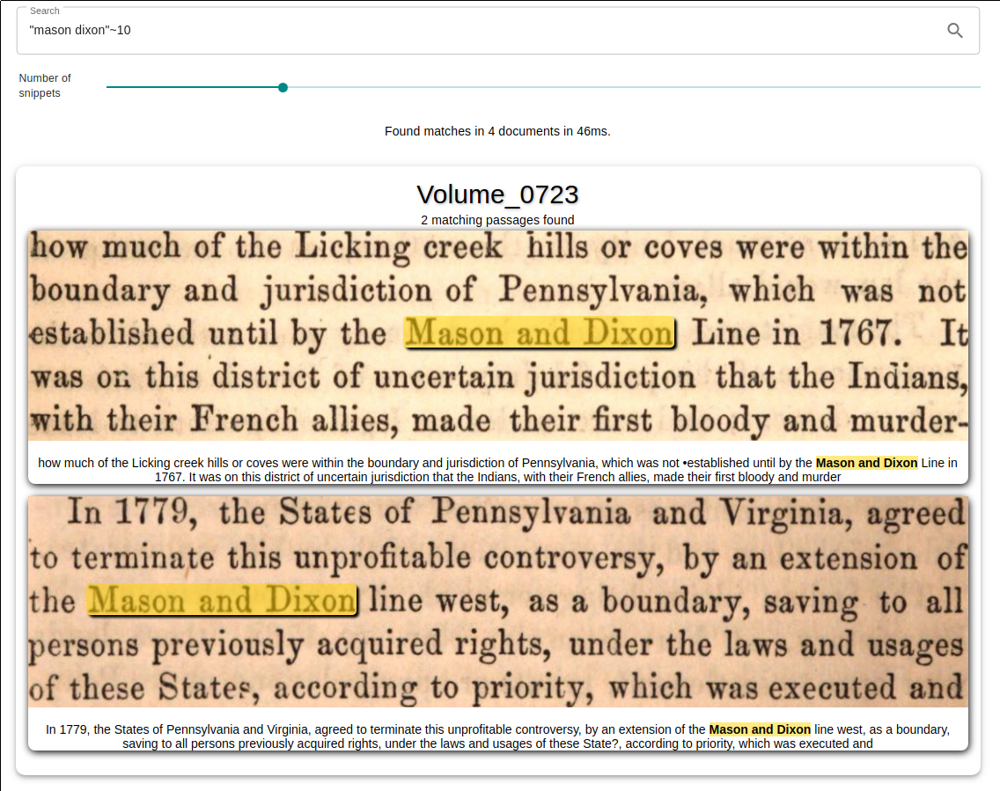
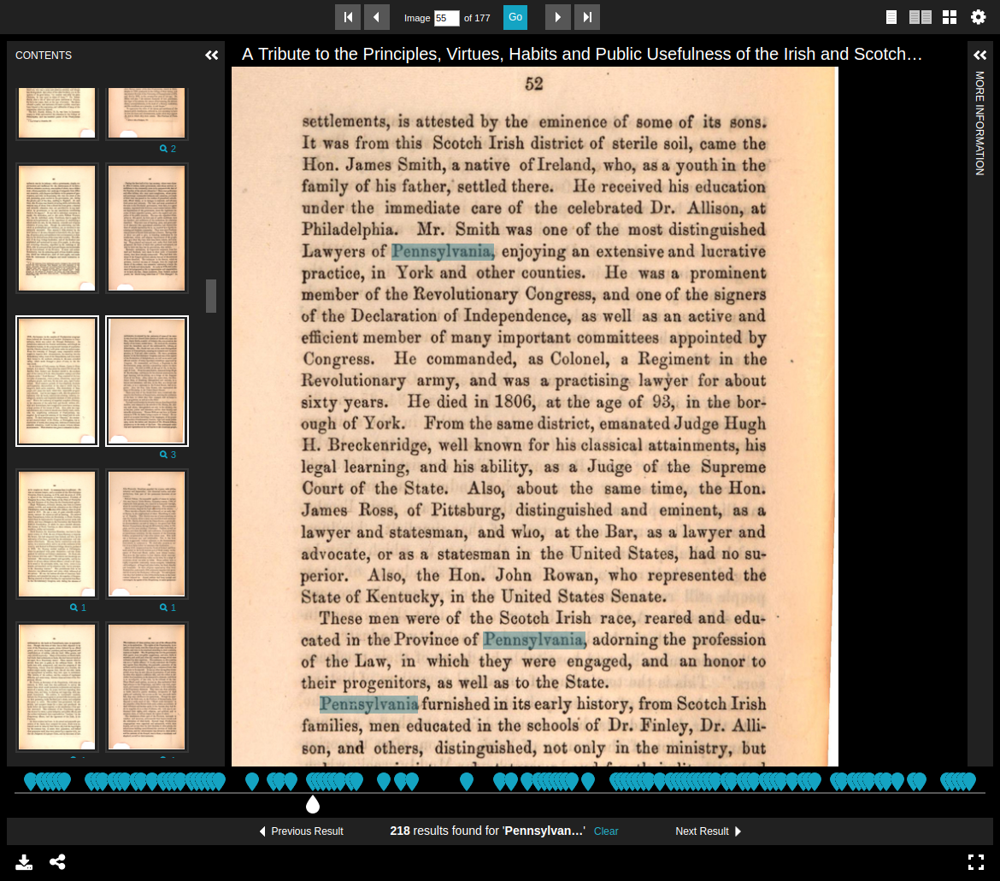

The repository includes a full-fledged example setup based on the [Google
Books 1000](http://yaroslavvb.blogspot.com/2011/11/google1000-dataset_09.html)
and the [BNL L'Union Newspaper](https://data.bnl.lu/data/historical-newspapers/) datasets.
The Google Books dataset consists of 1000 Volumes along with their OCRed text
in the hOCR format and all book pages as full resolution JPEG images.
The BNL dataset consists of 2712 newspaper issues in the ALTO format and all
pages as high resolution TIF images.

The example ships with a
search interface that allows querying the OCRed texts and displays the
matching passages as highlighted image and text snippets. Also included is a
small IIIF-Viewer that allows viewing the complete volumes and searching for
text within them.

## Online version

A public instance of this example is available at [https://ocrhl.jbaiter.de](https://ocrhl.jbaiter.de).

The Solr server can be queried at `https://ocrhl.jbaiter.de/solr`, e.g. for
[`q="mason dixon"~10"` in the Google Books corpus](https://ocrhl.jbaiter.de/solr/google1000/select?df=ocr_text&hl.fl=ocr_text&hl.snippets=10&hl.weightMatches=true&hl=on&q=%22mason+dixon%22%7E10)


## Prerequisites

To run the example setup yourself, you will need:

- Docker and `docker-compose`
- Python 3
- ~16GiB of free storage

## Running the example

1. `cd example`
2. `docker-compose up -d`
3. `./ingest_google100.py`
4. Access `http://localhost:8181` in your browser

## Search Frontend



## IIIF Content Search



## Solr Configuration Walkthrough

[`hOCR solrconfig.xml`](https://github.com/dbmdz/solr-ocrhighlighting/blob/master/example/solr/cores/google1000/conf/solrconfig.xml)
```xml

<!-- The Google 1000 books corpus used for the example is in the hOCR format -->
<searchComponent class="de.digitalcollections.solrocr.solr.HighlightComponent" name="ocrHighlight"
                 ocrFormat="de.digitalcollections.solrocr.formats.hocr.HocrFormat">
  <!-- We have a single field that contains OCR -->
  <lst name="ocrFields">
    <str>ocr_text</str>
  </lst>
  <!-- The example setup loads the ASCII-encoded OCR documents from local storage -->
  <fieldLoader class="de.digitalcollections.solrocr.lucene.fieldloader.PathFieldLoader" encoding="ascii">
    <lst name="externalFields">
      <!-- E.g. /google1000/Volume_0000.hocr -->
      <str name="ocr_text">/data/google1000/Volume_{id}.hocr</str>
    </lst>
  </fieldLoader>
</searchComponent>
```

[`hOCR schema.xml`](https://github.com/dbmdz/solr-ocrhighlighting/blob/master/example/solr/ocrtest/conf/schema.xml)
```xml
<fieldtype name="text_ocr" class="solr.TextField" storeOffsetsWithPositions="true" termVectors="true">
  <analyzer>
    <!-- Process the input hOCR files so that the rest of the chain only sees the plaintext version -->
    <charFilter class="de.digitalcollections.solrocr.formats.hocr.HocrCharFilterFactory" />
    <tokenizer class="solr.StandardTokenizerFactory"/>
    <filter class="solr.LowerCaseFilterFactory"/>
    <filter class="solr.StopFilterFactory"/>
    <filter class="solr.PorterStemFilterFactory"/>
  </analyzer>
</fieldtype>
```

[`ALTO solrconfig.xml`](https://github.com/dbmdz/solr-ocrhighlighting/blob/master/example/solr/cores/bnl_lunion/conf/solrconfig.xml)
```xml
<!-- The BNL L'Union corpus uses the ALTO format with one XML file per page -->
<searchComponent class="de.digitalcollections.solrocr.solr.HighlightComponent" name="ocrHighlight"
                ocrFormat="de.digitalcollections.solrocr.formats.alto.AltoFormat">
  <lst name="ocrFields">
    <str>ocr_text</str>
  </lst>
  <fieldLoader class="de.digitalcollections.solrocr.lucene.fieldloader.PathFieldLoader" encoding="ascii"
                multiple="true"> <!-- A single index document corresponds to multiple files-->
    <lst name="externalFields">
      <!-- We use field value slicing to build up the path pattern and match multiple files with a wildcard -->
      <str name="ocr_text">/data/bnl_lunion/{issue_id[:7]}_newspaper_lunion_{issue_id[8:]}/text/*.xml</str>
    </lst>
  </fieldLoader>
</searchComponent>
```

[`ALTO schema.xml`](https://github.com/dbmdz/solr-ocrhighlighting/blob/master/example/solr/cores/bnl_lunion/conf/schema.xml)
```xml
<fieldtype name="text_ocr" class="solr.TextField" storeOffsetsWithPositions="true" termVectors="true">
  <analyzer>
    <!-- Process the input ALTO files so that the rest of the chain only sees the plaintext version -->
    <charFilter class="de.digitalcollections.solrocr.formats.alto.AltoCharFilterFactory" />
    <tokenizer class="solr.StandardTokenizerFactory"/>
    <filter class="solr.LowerCaseFilterFactory"/>
    <filter class="solr.StopFilterFactory"/>
    <filter class="solr.PorterStemFilterFactory"/>
  </analyzer>
</fieldtype>
```