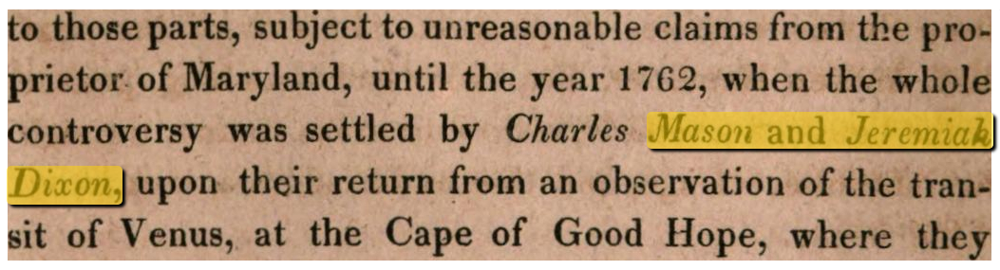

# Solr OCR Highlighting

This Solr plugin lets you put word-level OCR text into one or more of you documents'
fields and then allows you to obtain structured highlighting data with the text
and its position on the page at query time. All this without having to store
the OCR data in the index itself, but at arbitrary external locations instead.

It works by extending Solr's standard `UnifiedHighlighter` with support for
loading external field values and determining OCR positions from those field
values. This means that all options and query types supported by the
`UnifiedHighlighter` are also supported for OCR highlighting. The plugin also
works transparently with non-OCR fields and just lets the default
implementation handle those.

The plugin **works with all Solr versions >= 7.x** (tested with 7.6, 7.7 and 8.0).

## Features
- Index hOCR, ALTO or [MiniOCR](TODO: Link to doc page) directly without preprocessing
- Retrieve all the information needed to render a highlighted snippet view directly from Solr, without postprocessing
- Keeps your index size manageable by not necessarily storing the OCR in the index

## Getting Started

To get started, refer to the [Getting Started documentation](getting_started.md).
