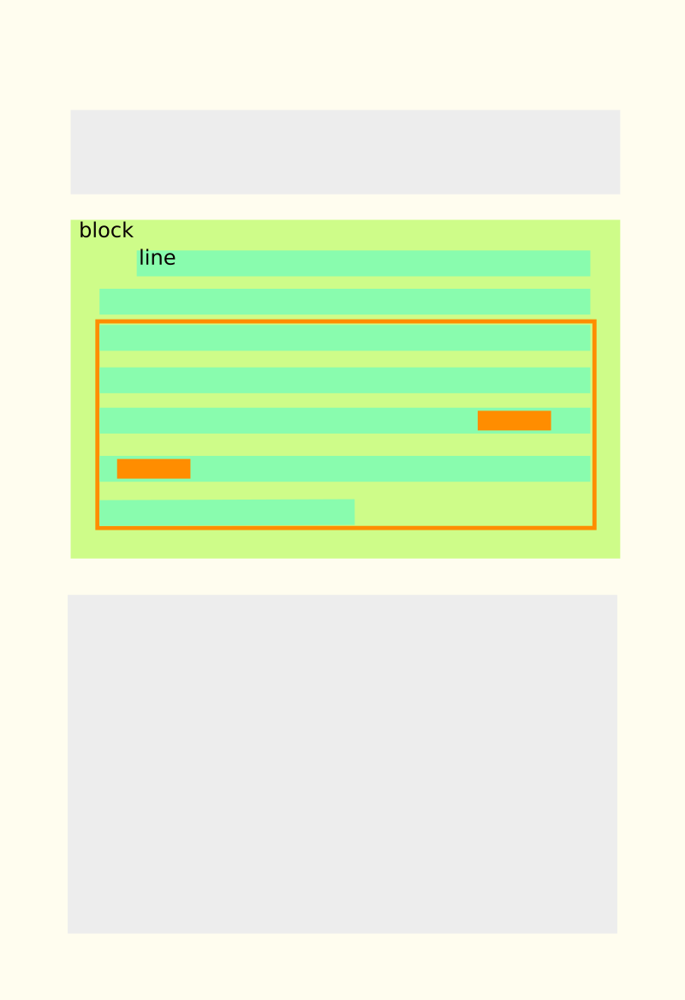

## Enabling Highlighting for OCR Fields
To enable highlighting, make sure you set `hl=true` in you query. Additionally, you need to pass the OCR fields that
you want to have highlighted in the `hl.ocr.fl` parameter.

!!! caution "Highlighting Non-OCR Fields"
    One unfortunate side effect of the way the plugin works is that you need to pass non-OCR fields to be highlighted
    **explicitly** via the `hl.fl` parameter. By default, Solr falls back on highlighting all stored fields if the
    parameter is not present, which no longer works if this plugin is used.

## Response Format
With OCR highlighting enabled, your Solr response will now include a new item `ocrHighlighting`, mapping all
highlighted OCR fields to their highlighting snippets:

`GET` [`https://ocrhl.jbaiter.de/solr/ocr/select?q=ocr_text:%22Mason%20Dixon%22~10&hl=true&hl.ocr.fl=ocr_text`](https://ocrhl.jbaiter.de/solr/ocr/select?q=ocr_text:%22Mason%20Dixon%22~10&hl=true&hl.ocr.fl=ocr_text)
```json
{
  "responseHeader": {
    "status": 0,
    "QTime": 111,
  },
  "response": {
    "numFound": 1,
    "start": 0,
    "docs": [{ "id": "doc_id" }]
  },
  "ocrHighlighting": {
    "ident": {
      "ocr_text": {
        "numTotal": 4,
        "snippets": [/* see below */]
      }
    }
  }
}
```

The `numTotal` key will specify how many highlighting snippets were found in the document for the query.
How many of these are actually contained in the response under the `snippets` key depends on the value
for the `hl.snippets` parameter, which defaults to `1`.

The objects contained under the `snippets` key are structured like this:
```json
{
  "text": "to those parts, subject to unreasonable claims from the proprietor "
          "of Maryland, until the year 17C2, when the whole controversy was "
          "settled by Charles <em>Mason and Jeremiah Dixon</em>, upon their "
          "return from an observation of the transit of Venus, at the Cape of "
          "Good Hope, where they",
  "score": 5555104.5,
  "pages": [
    { "id": "page_380", "width": 1436, "height": 2427 }
  ],
  "regions": [
    { "ulx": 196, "uly": 1703, "lrx": 1232, "lry": 1968, "pageIdx": 0 }
  ],
  "highlights":[
    [{ "text": "Mason and Jeremiah", "ulx": 675, "uly": 110, "lrx": 1036, "lry": 145,
       "parentRegionIdx": 0},
     { "text": "Dixon,", "ulx": 1, "uly": 167, "lrx": 119, "lry": 204,
       "parentRegionIdx": 0 }]
  ]
}
```

- `text` contains the plain text of the region containing one or more matches. The matches themselves are wrapped
  in `<em>` tags (this can be customized with the `hl.tag.pre` and `hl.tag.post` parameters).
- `score` contains the numerical score (relative to the whole document) that Solr assigned to the snippet
- `pages` contains a list of pages the snippet appears on along with their pixel dimensions. This can be useful
  for rendering highlights, e.g. if the highlighting target image is scaled down from the source image.
- `regions` contains a list of regions that the snippet is located on. Usually this will contain only one item,
  but in cases where a phrase spans multiple pages, it will contain a region for every page involved in the match.
  The object includes coordinates for all four corners it is defined by, as well as the identifier of the `page` the
  region is located on.
- `highlights` contains a list of regions that contain the actual matches for the query as well as the `text` that
  matched the query and the page the match occurred on. **Note that the coordinates are relative to the containing
  region, not the page** (this can be changed with the `hl.ocr.absoluteHighlights` parameter). To find the
  corresponding region for a match, use the `regionIdx` value, which refers to the index in the `regions` array that
  the surrounding region is located at.

## Generation of Snippet Regions

To determine how to build regions from a set of matches, the plugin takes into account the structure of the OCR
document surrounding each match. Consider the following page from a document, with two matches on two adjacent
lines.



First, the plugin will determine the **context** of each match, starting with the first match. For this, it searches
for a fixed number of **context blocks** before and after the block it is in. The type of context block is configured
with the `hl.ocr.contextBlock` parameter and it defaults to `line` (for a list of all possible block types, refer
to the full list of parameters). The number of context blocks to use for the
snippet context is set with the `hl.ocr.contextSize` parameter and defaults to `2`. So for our first match, the context
will be the two lines above and below the line of the match.

It then proceeds to the next match, which happens to be located on the next line block. If the new match is part of
the previous match's context, it will be **merged** into the previous snippet and the snippet will be updated.
In the example, the snippet would grow by two lines (since the context is two line blocks below the last match).

However, the plugin will not expand the context beyond the limits of certain blocks. In our example, we decided that
we don't want contexts to cross **block** elements. This **limit block** can be configured with the `hl.ocr.limitBlock`
parameter and defaults to `block` (which is format-dependent, but usually refers to a group of one or more paragraphs
). If, during context building, a block is encountered that is of this type (or an even higher level), the context
building will be stopped. In the example, the context of the snippet is only one line below the last match, since
this is the last line in the containing `block`. **Note that you will still occasionally get snippets that span multiple
blocks**, in the case when you searched for a phrase and the phrase match crosses multiple blocks.

## Available highlighting parameters

Since the OCR highlighter builds upon Solr's `UnifiedHighlighter`, you can use most of the
[Common Highlighter parameters](https://lucene.apache.org/solr/guide/8_1/highlighting.html#common-highlighter-parameters)
and the
[Unified Highlighter parameters](https://lucene.apache.org/solr/guide/8_1/highlighting.html#the-unified-highlighter).

Of special interest for purposes of OCR highlighting are these:

`hl`
:   Enable highlighting with `on`. **Required** if you want highlighting of any kind. Defaults to `off`.

`hl.snippets`
:   Number of snippets per document to include in the response, defaults to `1`.

`hl.tag.pre`/`hl.tag.post`
:   Strings to wrap matches in the plaintext version of the snippet with, defaults to `<em>`/`</em>`.

`hl.weightMatches`
:   Uses a new and improved highlighting algorithm that is much more precise than the old approach.
    For example, with this set to `true`, results for a phrase query `"foo bar baz"` will actually be
    highlighted as `<em>foo bar baz</em>` and not as `<em>foo</em> <em>bar</em> <em>baz</em>`. Defaults to
    `off` in Solr versions < 8.0, `on` for all versions > 8.0.

Additionally, the plugin allows you to customize various OCR-specific parameters:

`hl.ocr.fl`
:   Fields to enable OCR highlighting for. This is **required** if you want to have OCR highlighting.

`hl.ocr.contextBlock`
:   Select which block type should be considered for determining the context. Valid values are
    `word`, `line`, `paragraph`, `block` or `page` and defaults to `line`.

`hl.ocr.contextSize`
:   Set the number of blocks above and below the matching block to be included in the passage.
    Defaults to `2`.

`hl.ocr.limitBlock`
:   Set the block type that the passage context may not exceed. Valid values are `none` `word`, `line`,
    `paragraph`, `block` or `page`. This value defaults to `block`.

`hl.ocr.alignSpans`
:   Ensure that the spans in the highlighted text match the text of the highlighted image parts exactly.
    By default (`false`), text spans will be more precise than image spans, since they can be defined at the
    character-level, while image spans can only be as precise as the word boundaries in the OCR.

`hl.ocr.pageId`:
:   Only show passages from the page with this identifier. Useful in combination with a `fq` for a specific document
    if you want to implement a "Search on this page" feature (e.g. for the
    [IIIF Content Search API](https://iiif.io/api/search/1.0/)).

`hl.ocr.absoluteHighlights`:
:   When `on`, return the coordinates of highlighted regions as absolute coordinates, i.e. relative to the containing page,
    not the containing snippet region. Defaults to `off`.

`hl.ocr.maxPassages`:
:   Only score and rank at most this many passages to get the final list of snippets. This parameter can be used to tweak
    the performance. If you notice that highlighting takes a long time, you might consider lowering this value.
    The default is `100`. The practical result is that only the first `n` matches in a document will be considered
    for highlighting, i.e. if a more relevant passage occurs at the end of the document, it is more likely to not be
    considered if the total number of matches in the document exceeds this number.

`hl.ocr.timeAllowed`:
:   Due to the fact that generating highlighting snippets from disk can take a very long time, depending on the
    number of documents and snippets, you can limit the time OCR highlighting should take. The parameter takes the
    maximum allowed time in **milliseconds**. If the timeout is exceeded during highlighting, the document currently
    being highlighted and any other remaining documents will be skipped. The highlighting response will then only
    include snippets from documents that were highlighted before the timeout. The presence of partial results will be
    indicated by the `partialOcrHighlights` key in the `responseHeader`.

`hl.ocr.trackPages`:
:   When `off` (defaults to `on`), you will not get information the containing page of a given snippet.
    This can improve highlighting performance, since less of the input file needs to be read and should
    be disabled when you index your documents at the page-level, i.e. when the identify of the page is
    encoded elsewhere in the document.

`hl.ocr.scorePassages`:
:   When `off` (defaults to `on`), the snippets are returned in order of their occurrence in the document. Otherwise,
    it will follow Solr's default strategy for scoring highlighting snippets, which treats each candidate snippet as
    a 'mini-document' that is scored using TF-IDF/BM25, treating the parent document as the corpus. This results in
    a relevance score in relation to the parent document, i.e. the first snippet should be the most relevant snippet
    in the document.
